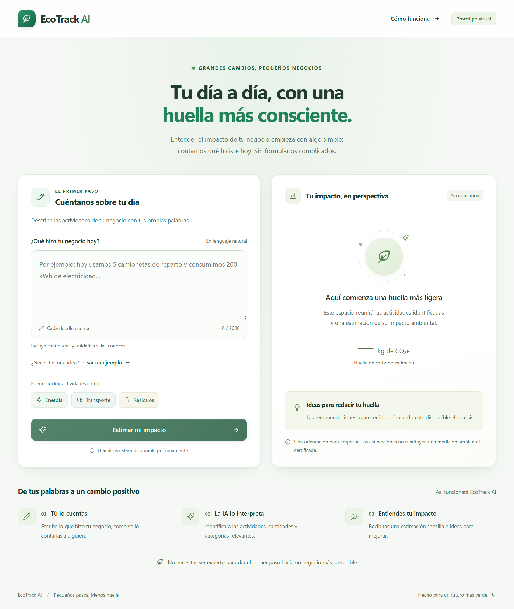
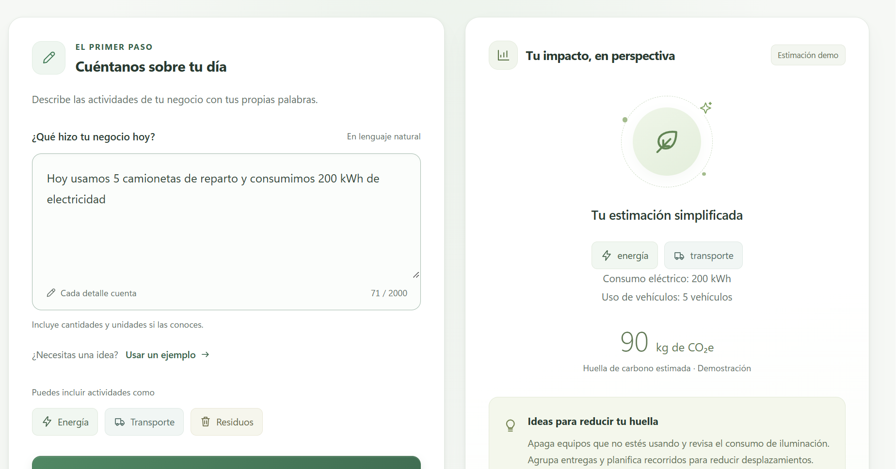
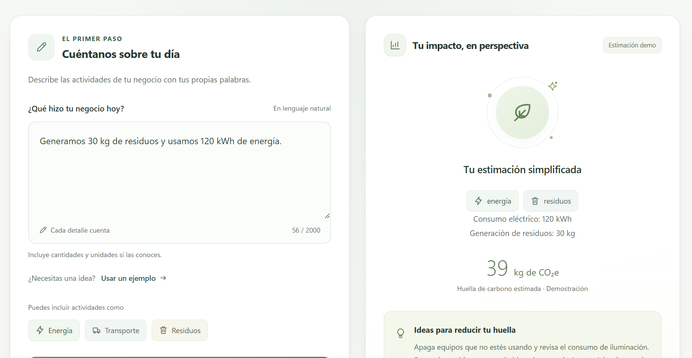
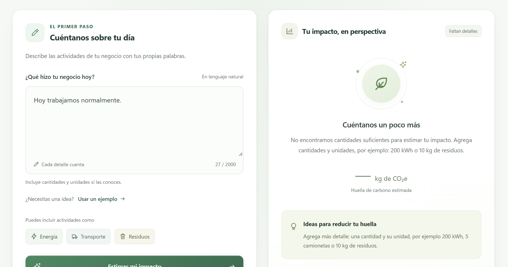
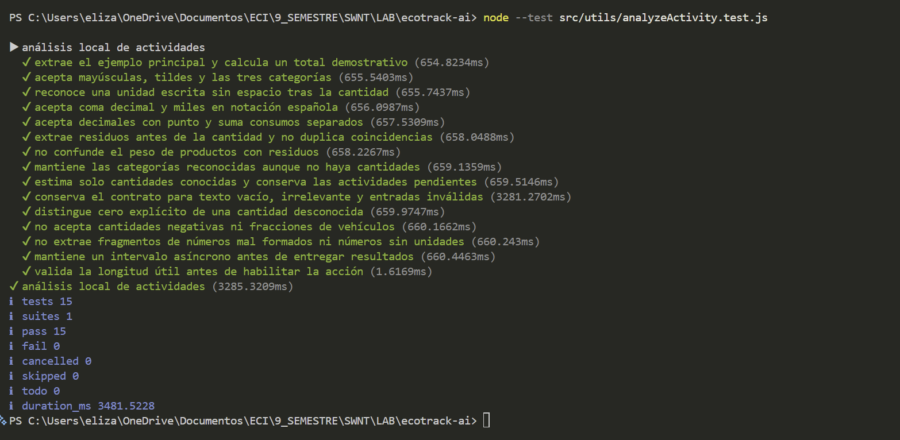
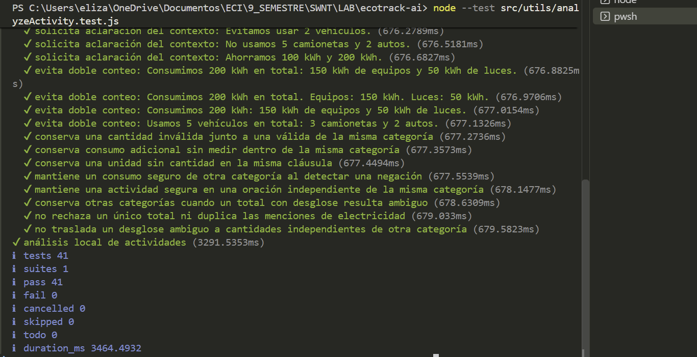
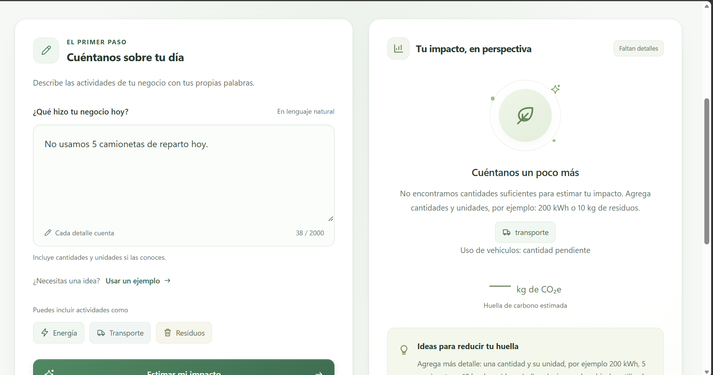
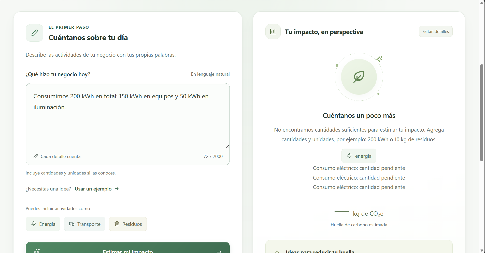
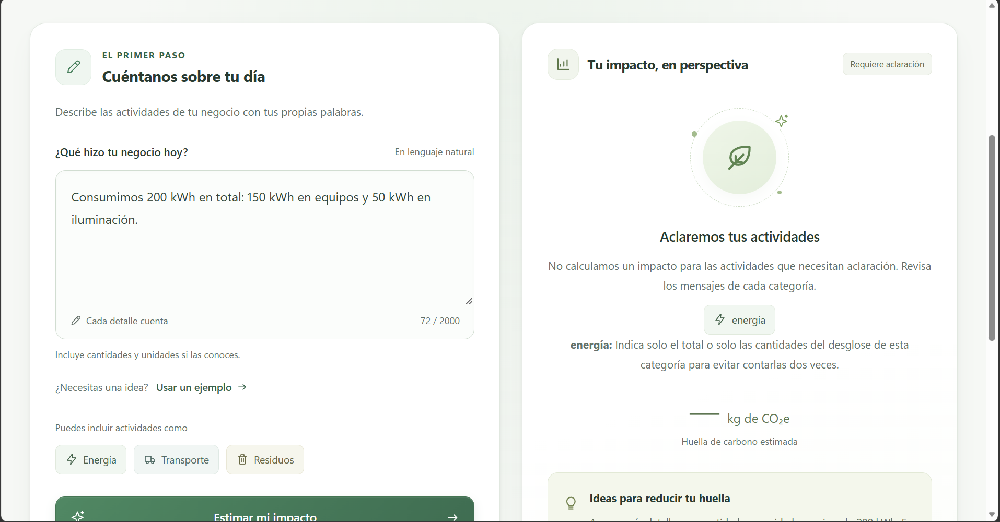

<div align="center">

# 🌱 EcoTrack AI

**Producto Mínimo Viable desarrollado como proyecto integrador del curso de Vibe Coding**

El objetivo del proyecto es demostrar cómo una aplicación web funcional puede ser diseñada, construida, refinada y depurada mediante un flujo de desarrollo asistido por Inteligencia Artificial, priorizando la intención, el contexto, la iteración, la validación y la dirección del producto sobre la escritura manual de código.

</div>

---

## 🔗 Enlaces del proyecto

| Recurso | Enlace |
|---|---|
| 📦 Repositorio | [EcoTrack AI](URL_REPOSITORIO) |
| 🚀 Aplicación desplegada | [EcoTrack AI Live](URL_VERCEL) *(pendiente de despliegue)* |
| 📓 Bitácora completa de prompts e iteraciones | [BITACORA.md](./BITACORA.md) |

---

## 📑 Tabla de contenido

<details>
<summary>Ver todas las secciones</summary>

1. [Descripción del proyecto](#1-descripción-del-proyecto)
2. [Problema identificado](#2-problema-identificado)
3. [Usuario objetivo](#3-usuario-objetivo)
4. [Definición del "Vibe"](#4-definición-del-vibe)
5. [Flujo principal de la aplicación](#5-flujo-principal-de-la-aplicación)
6. [Alcance del MVP](#6-alcance-del-mvp)
7. [Funcionalidad de IA implementada](#7-funcionalidad-de-ia-implementada)
8. [Preparación para una futura API real](#8-preparación-para-una-futura-api-real)
9. [Tecnologías utilizadas](#9-tecnologías-utilizadas)
10. [Herramientas utilizadas para Vibe Coding](#10-herramientas-utilizadas-para-vibe-coding)
11. [Metodología de Vibe Coding aplicada](#11-metodología-de-vibe-coding-aplicada)
12. [Master Prompt](#12-master-prompt)
13. [Resumen de iteraciones](#13-resumen-de-iteraciones)
14. [Desarrollo iterativo](#14-desarrollo-iterativo)
15. [Debugging asistido por IA](#15-debugging-asistido-por-ia)
16. [Estrategia de pruebas](#16-estrategia-de-pruebas)
17. [Evidencias del proceso](#17-evidencias-del-proceso)
18. [Bitácora de prompts](#18-bitácora-de-prompts)
19. [¿Cómo permitió Vibe Coding acelerar el desarrollo?](#19-cómo-permitió-vibe-coding-acelerar-el-desarrollo)
20. [Papel del desarrollador durante el proyecto](#20-papel-del-desarrollador-durante-el-proyecto)
21. [Reflexión final](#21-reflexión-final)
22. [Ejecución local](#22-ejecución-local)
23. [Próximos pasos](#23-próximos-pasos)

</details>

---

## 1. Descripción del proyecto

EcoTrack AI es una aplicación web orientada a pequeños negocios que necesitan una forma sencilla de obtener una primera aproximación a su huella de carbono.

En lugar de presentar formularios técnicos o extensos, la aplicación permite que el usuario describa sus actividades utilizando lenguaje natural.

> 💬 **Ejemplo:**
> "Hoy usamos 5 camionetas de reparto y consumimos 200 kWh de electricidad."

A partir de esta descripción, el sistema identifica categorías relevantes, extrae cantidades básicas y presenta una estimación demostrativa junto con recomendaciones.

---

## 2. Problema identificado

Los dueños o administradores de pequeños negocios pueden tener dificultades para comprender su impacto ambiental porque muchas herramientas de medición requieren:

- Formularios extensos
- Conocimiento técnico
- Múltiples datos especializados
- Tiempo adicional para completar el proceso
- Conocimientos previos sobre huella de carbono

EcoTrack AI busca simplificar esa primera aproximación permitiendo al usuario contar lo que ocurrió en su negocio con sus propias palabras.

---

## 3. Usuario objetivo

El MVP está dirigido principalmente a:

- Dueños de pequeños negocios
- Administradores
- Responsables operativos
- Personas sin conocimiento especializado en sostenibilidad

La experiencia está diseñada para que el usuario pueda interactuar con el sistema de forma natural y comprensible.

---

## 4. Definición del "Vibe"

Antes de construir el producto se definió la personalidad que debía transmitir EcoTrack AI.

**El MVP debía sentirse:**

| | | |
|---|---|---|
| ✅ Simple | ✅ Moderno | ✅ Sostenible |
| ✅ Confiable | ✅ Elegante | ✅ Amigable |
| ✅ Fácil de utilizar | ✅ Comprensible para usuarios no técnicos | |

**A nivel visual se definieron:**

- Tonos verdes asociados con sostenibilidad
- Fondos claros
- Tipografía moderna
- Tarjetas limpias
- Jerarquía visual clara
- Buen uso del espacio
- Diseño responsive
- Mensajes sencillos y orientados al usuario

---

## 5. Flujo principal de la aplicación

```text
Descripción en lenguaje natural
          ↓
Análisis de la entrada
          ↓
Identificación de categorías
          ↓
Extracción de cantidades
          ↓
Estimación demostrativa
          ↓
Recomendaciones
```

**Ejemplo de entrada:**

> "Hoy usamos 5 camionetas de reparto y consumimos 200 kWh de electricidad."

**Ejemplo de interpretación:**

| Categorías | Datos detectados |
|---|---|
| Energía | 200 kWh |
| Transporte | 5 vehículos |

**Resultado:**

- Estimación simplificada en kg de CO₂e
- Recomendaciones para reducir el impacto

---

## 6. Alcance del MVP

El proyecto se concentró en validar el flujo principal sin añadir funcionalidades que no eran necesarias para el objetivo académico.

**✅ El MVP incluye:**

- Entrada en lenguaje natural
- Análisis simulado
- Detección de energía
- Detección de transporte
- Detección de residuos
- Extracción de cantidades simples
- Estimación demostrativa de impacto
- Recomendaciones
- Manejo de datos insuficientes
- Manejo de entradas ambiguas
- Resultados parciales
- Estado de carga
- Interfaz responsive
- Validaciones
- Pruebas automatizadas
- Mensajes de aclaración para evitar resultados engañosos

**🚫 No se implementaron:**

- Autenticación
- Base de datos
- Persistencia
- Panel administrativo
- Historial de usuarios

> Estas funcionalidades no eran necesarias para demostrar el flujo principal del MVP.

---

## 7. Funcionalidad de IA implementada

El enunciado permite que la funcionalidad impulsada por IA sea real o simulada. En este MVP se implementó una **simulación local del análisis de lenguaje natural**.

La decisión permitió concentrar el esfuerzo en:

- El flujo del usuario
- La interpretación de actividades
- La estructura de datos
- La validación
- El manejo de ambigüedades
- La arquitectura para una futura integración real

La lógica principal se encuentra separada de la interfaz en:

```
src/utils/analyzeActivity.js
```

La función devuelve una estructura consistente con:

```js
{
  actividadesDetectadas,
  categorias,
  impactoEstimado,
  unidadImpacto,
  recomendaciones
}
```

Esto permite mantener desacoplada la lógica de análisis de los componentes visuales.

> ⚠️ **Nota:** los factores utilizados son ficticios y tienen únicamente fines demostrativos. EcoTrack AI no representa una medición ambiental certificada.

---

## 8. Preparación para una futura API real

Aunque el MVP utiliza análisis simulado, la arquitectura se diseñó para facilitar una futura sustitución por una API de IA.

**Flujo actual:**

```text
React UI
   ↓
analyzeActivity()
   ↓
Simulación local
   ↓
Resultado estructurado
```

**Posible evolución futura:**

```text
React UI
   ↓
Backend / API
   ↓
Modelo de IA
   ↓
Respuesta estructurada
   ↓
EcoTrack AI
```

La interfaz depende del **contrato de salida** y no de la forma interna en la que se realiza el análisis.

---

## 9. Tecnologías utilizadas

| Tecnología | Uso |
|---|---|
| React | Construcción de la interfaz |
| Vite | Entorno de desarrollo y build |
| JavaScript | Lógica de aplicación |
| CSS | Estilos y diseño responsive |
| ESLint | Validación estática |
| Node Test Runner | Pruebas automatizadas |
| Git | Control de versiones |
| GitHub | Repositorio |
| Visual Studio Code | Editor de desarrollo |
| ChatGPT | Asistencia mediante Vibe Coding |

---

## 10. Herramientas utilizadas para Vibe Coding

El desarrollo se realizó utilizando:

- Visual Studio Code como entorno de desarrollo
- ChatGPT Codex como asistente de IA
- Git y GitHub como sistema de control de versiones
- Terminal integrada para ejecutar pruebas, compilación y validaciones

Aunque el curso presenta herramientas como Cursor, Replit Agent o Bolt.new, el proyecto utilizó Visual Studio Code porque ofrecía un entorno de trabajo familiar, mientras ChatGPT se utilizó para generación, refinamiento, análisis y debugging mediante lenguaje natural.

---

## 11. Metodología de Vibe Coding aplicada

El proyecto no fue construido a partir de un único prompt. Se trabajó mediante un proceso iterativo:

```text
Definir intención
      ↓
Generar
      ↓
Ejecutar
      ↓
Observar
      ↓
Dar feedback
      ↓
Analizar problemas
      ↓
Corregir de forma localizada
      ↓
Validar
      ↓
Consolidar
```

Durante el desarrollo se aplicaron conceptos vistos en el curso:

- Prompting iterativo
- Modularidad
- Referencia por bloques
- Negative constraints
- Cambios pequeños
- Validación crítica
- Check-and-Balance
- Debugging asistido por IA
- Refinamiento incremental
- Feedback específico
- Separación entre análisis y presentación

---

## 12. Master Prompt

El desarrollo comenzó con un **Master Prompt** que estableció el objetivo, contexto, flujo, estilo visual y restricciones principales del proyecto.

Entre las reglas definidas se incluyeron:

- Trabajar de forma modular
- Realizar cambios pequeños
- Evitar modificar componentes estables innecesariamente
- No agregar dependencias externas sin autorización
- No eliminar lógica existente
- Indicar los archivos que serían modificados
- Preguntar antes de asumir información ambigua

El Master Prompt completo y todas las iteraciones utilizadas se encuentran en:

➡️ **[BITACORA.md](./BITACORA.md)**

---

## 13. Resumen de iteraciones

| Iteración | Objetivo | Resultado |
|---|---|---|
| 1 | Crear estructura visual | Interfaz base, modular y responsive |
| 2 | Refinamiento visual | Mejora de tipografía, color, jerarquía y espaciado |
| 3 | Implementar análisis simulado | Flujo funcional de entrada, análisis y resultado |
| 4 | Validación crítica | Diagnóstico de errores sin modificar código |
| 5 | Corregir errores críticos | Mejora de interpretación y pruebas de regresión |
| 6 | Mejorar feedback de ambigüedades | Mensajes más claros y comprensibles |

---

## 14. Desarrollo iterativo

### Iteración 1 — Estructura visual

El primer objetivo fue construir únicamente la estructura visual del MVP.

**Resultado:**

- Diseño responsive
- Tonos verdes
- Tarjetas
- Entrada de actividades
- Panel vacío de impacto
- Sección de recomendaciones
- Componentes modulares
- Lógica de IA todavía deshabilitada

<p align="center">
  
  <br>
  <em>Evidencia — estructura visual inicial</em>
</p>

### Iteración 2 — Refinamiento visual

La segunda iteración se concentró exclusivamente en el diseño.

**Se modificaron únicamente:**

- `src/index.css`
- `src/App.css`

**Mejoras:**

- Tipografía
- Jerarquía
- Tonos verdes más vivos
- Mayor espaciado
- Sombras
- Profundidad visual
- Campo de texto más amplio
- Botón principal más destacado

La lógica permaneció intacta.

<p align="center">
  
  <br>
  <em>Evidencia — refinamiento visual</em>
</p>

### Iteración 3 — Análisis simulado

Se implementó una función local capaz de:

- Detectar energía
- Detectar transporte
- Detectar residuos
- Extraer cantidades
- Generar recomendaciones
- Calcular una estimación demostrativa
- Solicitar más información cuando los datos eran insuficientes

La lógica se separó de la interfaz en:

```
src/utils/analyzeActivity.js
```

<p align="center">
  
  <br>
  <em>Ejemplo: energía y transporte</em>
</p>

<p align="center">
  
  <br>
  <em>Ejemplo: energía y residuos</em>
</p>

<p align="center">
  
  <br>
  <em>Ejemplo: información insuficiente</em>
</p>

### Iteración 4 — Check-and-Balance

En lugar de pedir directamente una corrección, se solicitó a la IA:

> "No escribas código todavía. Analiza críticamente la implementación sin modificar código."

La IA identificó errores reales relacionados con:

- Números ambiguos
- Negaciones
- Expresiones de ahorro
- Doble conteo
- Resultados parciales
- Asociación incorrecta de cantidades
- Validación
- Contrato para futura API
- Estados de error
- Cobertura de pruebas
- Accesibilidad

Esta iteración fue utilizada como ejercicio de debugging asistido por IA. El diagnóstico completo está documentado en:

➡️ **[BITACORA.md](./BITACORA.md)**

### Iteración 5 — Corrección de errores críticos

Se corrigieron únicamente los problemas de mayor prioridad.

**La IA modificó:**

- `src/utils/analyzeActivity.js`
- Y sus pruebas

**Se mejoró el manejo de:**

- Números fragmentados
- Signos negativos
- Signos Unicode
- Fracciones
- Rangos ambiguos
- Negaciones
- Ahorros
- Totales y desgloses
- Resultados parciales

También se agregaron advertencias estructuradas.

**Evolución de pruebas:**

| Momento | Pruebas aprobadas |
|---|---|
| Inicialmente | 15 |
| Después del proceso de debugging | 41 |

<p align="center">
  
  <br>
  <em>15 pruebas aprobadas</em>
</p>

<p align="center">
  
  <br>
  <em>41 pruebas aprobadas</em>
</p>

<p align="center">
  
  <br>
  <em>Validación manual de negación</em>
</p>

<p align="center">
  
  <br>
  <em>Validación manual de doble conteo</em>
</p>

### Iteración 6 — Mejora del feedback

Después de corregir la lógica se realizaron pruebas manuales. Se observó que el análisis era correcto, pero la interfaz todavía mostraba mensajes demasiado genéricos.

**Se actualizó:**

```
src/components/ImpactPreview.jsx
```

**Para:**

- Mostrar advertencias junto a su categoría
- Agrupar mensajes repetidos
- Explicar qué información necesita aclaración
- Explicar qué datos se excluyen de la estimación
- Evitar mostrar resultados engañosos

<p align="center">
  
  <br>
  <em>Feedback final ante una negación</em>
</p>

<p align="center">
  
  <br>
  <em>Feedback final ante total y desglose</em>
</p>

---

## 15. Debugging asistido por IA

Uno de los requisitos del proyecto era identificar un desafío técnico y explicar cómo se utilizó IA para solucionarlo sin escribir manualmente la corrección.

El principal caso de debugging fue la **interpretación de lenguaje natural**. Inicialmente las pruebas pasaban, pero la revisión crítica reveló entradas capaces de producir resultados incorrectos.

**Ejemplos:**

- `1 000 kWh`
- `−200 kWh`
- `1/2 camionetas`

También se identificaron problemas con frases como:

- "No usamos 5 camionetas."
- "Ahorramos 200 kWh."

y:

> "Consumimos 200 kWh en total: 150 kWh en equipos y 50 kWh en iluminación."

En vez de pedir inmediatamente una corrección, se utilizó la técnica de **Check-and-Balance**. Primero se pidió:

> "No escribas código todavía. Analiza por qué puede fallar."

Después del diagnóstico se realizó una iteración específica para corregir únicamente los problemas críticos. Este proceso evitó modificaciones innecesarias en otros componentes.

---

## 16. Estrategia de pruebas

La validación evolucionó durante el desarrollo:

| Etapa | Pruebas aprobadas | Detalle |
|---|---|---|
| Primera etapa | 15 | — |
| Después del debugging | 41 | 15 anteriores + 26 de regresión |
| Después de mejorar la presentación | **51** | 41 anteriores + 10 de presentación |

**Estado final:**

✅ 51 pruebas aprobadas
✅ ESLint: correcto
✅ Build: correcto

**Las pruebas incluyen:**

- Números enteros
- Números decimales
- Formato español
- Energía
- Transporte
- Residuos
- Cero explícito
- Cantidades negativas
- Fracciones
- Números mal formados
- Datos insuficientes
- Negaciones
- Ahorros
- Totales
- Desgloses
- Resultados parciales
- Validación de entrada
- Estados de presentación

---

## 17. Evidencias del proceso

Todas las evidencias visuales se encuentran dentro de [`docs/images/`](./docs/images/).

### 17.1 Interfaz inicial

Primera estructura visual del MVP, todavía sin lógica de análisis.

<p align="center">
  
</p>

### 17.2 Refinamiento visual

Mejora visual mediante una iteración controlada sin modificar funcionalidad.

<p align="center">
  
</p>

### 17.3 Análisis de energía y transporte

Ejemplo funcional con energía y transporte.

<p align="center">
  
</p>

### 17.4 Análisis de energía y residuos

Ejemplo funcional con energía y residuos.

<p align="center">
  
</p>

### 17.5 Manejo de información insuficiente

El sistema evita generar resultados cuando la información no es suficiente.

<p align="center">
  
</p>

### 17.6 Primeras pruebas automatizadas

Primera validación técnica del flujo simulado.

<p align="center">
  
</p>

### 17.7 Pruebas después del debugging

Después de detectar errores se añadieron pruebas de regresión.

<p align="center">
  
</p>

### 17.8 Validación de negaciones

El sistema evita interpretar una negación como una actividad realizada.

<p align="center">
  
</p>

### 17.9 Prevención de doble conteo

El sistema evita sumar un total junto con su desglose.

<p align="center">
  
</p>

### 17.10 Feedback mejorado ante negaciones

La aplicación explica por qué esa entrada necesita aclaración.

<p align="center">
  
</p>

### 17.11 Feedback mejorado ante total y desglose

La aplicación explica cómo evitar contar dos veces la misma información.

<p align="center">
  
</p>

---

## 18. Bitácora de prompts

La documentación detallada de todos los prompts se encuentra en:

➡️ **[BITACORA.md](./BITACORA.md)**

**La bitácora contiene:**

- Master Prompt
- Objetivo de cada iteración
- Prompt completo
- Resultado obtenido
- Problemas encontrados
- Decisiones tomadas
- Aprendizajes
- Evolución de pruebas

**Prompts documentados:**

1. Master Prompt v1
2. Prompt de Iteración 2 — Refinamiento visual
3. Prompt de Iteración 3 — Lógica de análisis simulada
4. Prompt de Iteración 4 — Validación crítica y diagnóstico
5. Prompt de Iteración 5 — Corrección de errores críticos
6. Prompt de Iteración 6 — Feedback específico de ambigüedades

---

## 19. ¿Cómo permitió Vibe Coding acelerar el desarrollo?

Vibe Coding permitió concentrar el esfuerzo en definir:

- Qué debía hacer el producto
- Qué experiencia debía ofrecer
- Qué comportamiento era aceptable
- Qué problemas debían corregirse
- Qué partes debían mantenerse intactas

**La IA fue utilizada para:**

- Generar componentes
- Construir lógica
- Refinar la interfaz
- Diagnosticar problemas
- Proponer correcciones
- Generar pruebas
- Ampliar la cobertura
- Mejorar mensajes de usuario

En un flujo tradicional, muchas de estas tareas habrían requerido escribir manualmente cada cambio, revisar sintaxis, crear múltiples casos de prueba y depurar cada problema de forma manual.

**Con Vibe Coding el proceso se convirtió en:**

```text
intención → prompt → resultado → observación → crítica → refinamiento → validación
```

Esto permitió avanzar más rápido, pero también mostró que la velocidad no elimina la necesidad de revisión humana.

---

## 20. Papel del desarrollador durante el proyecto

El desarrollador no desaparece dentro del proceso de Vibe Coding.

**Durante EcoTrack AI fue necesario:**

- Definir el alcance
- Establecer restricciones
- Revisar resultados
- Detectar errores
- Decidir qué corregir
- Evitar modificaciones innecesarias
- Diseñar casos de prueba
- Validar la experiencia final

La IA fue utilizada como ejecutor y colaborador, mientras las decisiones de arquitectura, alcance y aceptación permanecieron bajo control humano.

---

## 21. Reflexión final

EcoTrack AI permitió aplicar de forma práctica los conceptos vistos en el curso.

Uno de los principales aprendizajes fue que **una respuesta generada por IA no debe aceptarse automáticamente**.

Durante el proyecto se llegó a un punto donde 15 pruebas pasaban correctamente, pero una revisión crítica mostró que todavía existían situaciones capaces de producir resultados incorrectos.

Esto llevó a realizar nuevas iteraciones, ampliar la cobertura y terminar con **51 pruebas aprobadas**.

El proceso demostró que Vibe Coding no significa:

> prompt → aceptar todo

sino:

> definir → generar → observar → cuestionar → corregir → validar

La IA permitió acelerar el desarrollo, pero la calidad final dependió de mantener una visión clara, limitar el alcance de los cambios y validar cada iteración.

---

## 22. Ejecución local

```bash
# Clonar el repositorio
git clone URL_REPOSITORIO

# Entrar al proyecto
cd ecotrack-ai

# Instalar dependencias
npm install

# Ejecutar en desarrollo
npm run dev

# Ejecutar pruebas
npm test

# Validar ESLint
npm run lint

# Generar build
npm run build
```
---

## 23. Próximos pasos

Como evolución futura del proyecto se podría:

- Reemplazar la simulación por una API real de IA
- Incorporar factores de emisión certificados
- Añadir persistencia
- Mostrar historial de análisis
- Añadir autenticación
- Incluir reportes
- Permitir comparación temporal
- Incorporar diferentes tipos de negocio

---

<div align="center">

**Autor:** Elizabeth Correa Suarez

</div>

